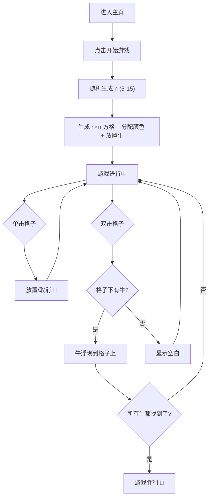

## 1. 产品概述

彩色牛牛（ColorCow）是一款基于 Vue 的逻辑推理小游戏。玩家在 n×n 的彩色方格中，通过单击标记🚩、双击揭开格子，找出隐藏在每种颜色下的牛。每行每列恰好一头牛，且牛之间互不相邻，玩家需运用逻辑推理完成挑战。

- 目标用户：休闲游戏玩家、逻辑推理爱好者
- 核心价值：将扫雷类推理与色彩视觉相结合，提供轻松又烧脑的游戏体验

## 2. 核心功能

### 2.1 功能模块

1. **游戏主页**：开始游戏按钮、规则说明、难度展示
2. **游戏页面**：n×n 彩色方格、交互操作、状态面板

### 2.2 页面详情

| 页面名称 | 模块名称 | 功能描述 |
|----------|----------|----------|
| 游戏主页 | 英雄区 | 游戏标题、动态背景、开始游戏按钮 |
| 游戏主页 | 规则说明 | 游戏规则简述（每行每列一头牛、牛不相邻、操作方式） |
| 游戏页面 | 彩色方格 | n×n 方格，每格显示颜色，隐藏牛属性 |
| 游戏页面 | 状态面板 | 已找到牛数/总牛数、重新开始按钮 |
| 游戏页面 | 胜利提示 | 全部牛找到后弹出胜利动画 |

## 3. 核心流程

1. 玩家进入主页，点击"开始游戏"
2. 系统随机生成 n（5-15），创建 n×n 方格，分配 n 种颜色，放置 n 头牛（满足约束条件）
3. 所有格子初始只显示颜色
4. 玩家单击格子 → 放置/取消🚩（标记无牛）
5. 玩家双击格子 → 揭开格子：有牛则牛浮现，无牛则显示空白
6. 找到所有牛后，游戏胜利

## 4. 用户界面设计

### 4.1 设计风格

- 主色调：暖色系田园风（草地绿 #4CAF50、天空蓝 #81D4FA、阳光黄 #FFD54F）
- 辅助色：奶牛黑白斑纹元素
- 按钮风格：圆角、微阴影、hover 放大效果
- 字体：标题使用趣味手写风字体，正文使用清晰无衬线字体
- 布局风格：居中卡片式布局，方格区域为视觉焦点
- 图标/表情：牛🐄、旗帜🚩、胜利🎉

### 4.2 页面设计概览

| 页面名称 | 模块名称 | UI 元素 |
|----------|----------|---------|
| 游戏主页 | 英雄区 | 大标题 + 奶牛插画背景 + 居中开始按钮，渐变背景，浮动动画 |
| 游戏主页 | 规则说明 | 半透明卡片，图标+文字说明，3条核心规则 |
| 游戏页面 | 彩色方格 | n×n CSS Grid 方格，每格圆角、颜色填充，hover 微缩放 |
| 游戏页面 | 状态面板 | 顶部固定栏，显示进度条和牛计数，重新开始按钮 |
| 游戏页面 | 胜利提示 | 全屏遮罩 + 居中弹窗，confetti 动画，再来一局按钮 |

### 4.3 响应式

- 桌面优先设计，方格大小根据 n 自适应缩放
- 移动端适配：方格缩小，支持触摸单击/双击操作
- 触摸优化：双击间隔 300ms 内判定为双击

### 4.4 游戏逻辑约束

- n 种颜色均匀分布在 n×n 方格中，每种颜色恰好 n 格
- 每行恰好一头牛，每列恰好一头牛
- 牛的周围 8 格（上下左右及对角线）不能有其他牛
- 颜色分配需确保每种颜色恰好包含一头牛
