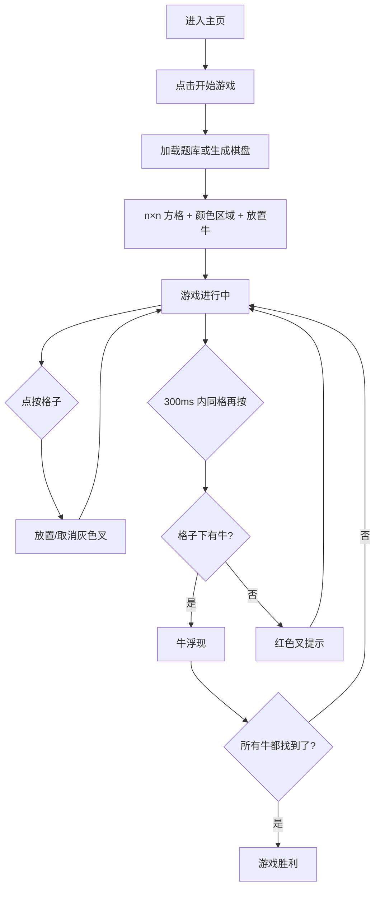

## 1. 产品概述

彩色牛牛（ColorCow）是一款基于 Vue 的逻辑推理小游戏。玩家在 n×n 的彩色方格中，通过点按标记灰色叉、快速双击揭开格子，找出隐藏在每种颜色区域下的牛。每行每列恰好一头牛，且牛之间互不相邻，玩家需运用逻辑推理完成挑战。

- 目标用户：休闲游戏玩家、逻辑推理爱好者
- 核心价值：将扫雷类推理与色彩视觉相结合，提供轻松又烧脑的游戏体验

## 2. 核心功能

### 2.1 功能模块

1. **游戏主页**：开始游戏按钮、规则说明
2. **游戏页面**：n×n 彩色方格、交互操作、状态面板、提示与辅助功能
3. **题库**：`public/puzzles/` 预置 JSON 关卡，优先随机未玩过的题目

### 2.2 页面详情

| 页面名称 | 模块名称 | 功能描述 |
|----------|----------|----------|
| 游戏主页 | 英雄区 | 游戏标题、动态背景、开始游戏按钮 |
| 游戏主页 | 规则说明 | 核心约束与操作方式（点按叉、双击揭开、滑动批量标记） |
| 游戏页面 | 彩色方格 | n×n 方格，每格显示颜色，隐藏牛属性 |
| 游戏页面 | 状态面板 | 已找到牛数/总牛数、进度条、边长、VIP 开关、重新开始 |
| 游戏页面 | 提示栏 | 按推理规则给出一步提示，可应用或关闭 |
| 游戏页面 | 辅助操作 | 随机揭开一头牛（+牛）、导入/导出 JSON 关卡 |
| 游戏页面 | 胜利提示 | 全部牛找到后弹出胜利动画 |

## 3. 核心流程

1. 玩家进入主页，点击「开始游戏」
2. 系统从 easy 题库随机选一关（记录已玩 ID，尽量不重题）；无题库时按 easy 模式现场生成
3. 边长 n 由题目决定（题库目前约 4×4～12×12；主页文案为 4×4～15×15）
4. 所有格子初始只显示颜色
5. 玩家点按格子 → 放置/取消灰色叉（标记无牛）
6. 玩家在同一格 300ms 内再次点按 → 揭开：有牛则牛浮现；无牛则红色叉（不判负，可继续）
7. 玩家按住并滑动 → 批量打叉或批量取消叉
8. 找齐全部 n 头牛后，游戏胜利

## 4. 用户界面设计

### 4.1 设计风格

- 主色调：暖色系田园风（草地绿 #4CAF50、天空蓝 #81D4FA、阳光黄 #FFD54F）
- 辅助色：奶牛元素（CowSprite 雪碧图）
- 按钮风格：圆角、微阴影、hover 放大效果
- 布局风格：居中卡片式布局，方格区域为视觉焦点
- 图标/表情：牛🐄、灰色叉（标记）、红色叉（揭错）、胜利🎉

### 4.2 页面设计概览

| 页面名称 | 模块名称 | UI 元素 |
|----------|----------|---------|
| 游戏主页 | 英雄区 | 大标题 + 奶牛 emoji + 居中开始按钮，渐变背景 |
| 游戏主页 | 规则说明 | 半透明卡片，图标+文字（约束与三种操作） |
| 游戏页面 | 彩色方格 | n×n CSS Grid，圆角、颜色填充 |
| 游戏页面 | 状态面板 | 牛计数、进度条、n×n 标签、VIP、重来 |
| 游戏页面 | 提示栏 | 规则名、描述、应用/关闭 |
| 游戏页面 | 胜利提示 | 全屏遮罩 + 居中弹窗，再来一局 |

### 4.3 响应式

- 桌面优先，方格大小根据 n 自适应缩放
- 移动端支持触摸点按、300ms 内同格双击揭开、滑动批量标记

### 4.4 游戏逻辑约束

**棋盘与答案（每局固定）**

- n×n 棋盘，共 n 种颜色；每种颜色形成一片**连通区域**（easy 模式为四连通相邻）
- 区域格数不必相等，总面积为 n²
- 每行恰好一头牛，每列恰好一头牛
- 每种颜色恰好一头牛
- 任意两头牛的行差、列差不能同时 ≤ 1（周围 8 格内不能再有牛）

**玩家操作与结果**

- 灰色叉：玩家标记「此处无牛」
- 揭开有牛：计入进度；可选 VIP 自动给同行、同列、周围 8 格打叉
- 揭开无牛：红色叉，**无失败/Game Over**
- 胜利条件：找齐全部 n 头牛

**难度模式（实现层面）**

| 模式 | 颜色区域连通 | 当前产品 |
|------|----------------|----------|
| easy | 上下左右四连通 | 默认，题库与对局均使用 |
| hard | 含对角八连通 | 类型与生成器保留，manifest 暂无题目 |

**题库质量（生成脚本可选校验）**

- 合法放牛：满足行/列/颜色/不相邻约束
- 唯一解（可选）：在已知颜色布局下仅一种放牛方案
- 提示链可解：仅依靠游戏内提示规则可推到通关

## 5. 提示与辅助（非核心约束）

| 功能 | 说明 |
|------|------|
| 提示 | 按 `hintRules.ts` 中多条推理规则依次尝试，给出画叉或确定牛的下一步 |
| ~~猜测提示~~ | 已关闭（完善规则链路与唯一解后再考虑启用） |
| +牛 | 随机揭开一头尚未揭开的牛 |
| VIP | 揭开牛后自动标记同行、同列、周围 8 格 |
| 导入/导出 | JSON：`n`、`mode`、`colorGrid`、`cows` |
