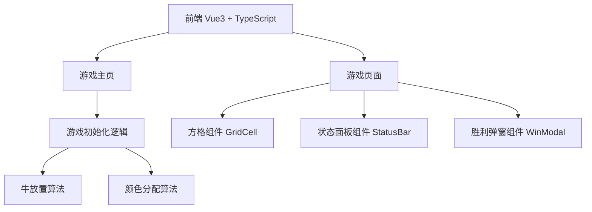

## 1. 架构设计



纯前端项目，无后端服务。

## 2. 技术说明

- 前端：Vue 3 + TypeScript + Tailwind CSS + Vite
- 初始化工具：vite-init（vue-ts 模板）
- 后端：无
- 数据库：无

## 3. 路由定义

| 路由 | 用途 |
|------|------|
| / | 游戏主页，含开始按钮和规则说明 |
| /game | 游戏页面，含 n×n 方格和交互逻辑 |

## 4. 核心算法

### 4.1 牛放置算法

1. 生成一个 n 元素的随机排列（确保每行每列一头牛）
2. 检查相邻约束：任意两头牛的行差和列差不能同时 ≤1
3. 若不满足，重新生成排列，最多重试 1000 次
4. 若仍不满足，使用回溯法逐行放置

### 4.2 颜色分配算法

1. 定义 n 种预设颜色
2. 每种颜色需要恰好 n 个格子，且恰好包含一头牛
3. 将牛的位置分配给不同颜色（牛 i 分配颜色 i）
4. 剩余格子按颜色均匀分配（每种颜色还需 n-1 个格子）

## 5. 数据模型

### 5.1 核心类型定义

```typescript
interface CellState {
  colorIndex: number
  hasCow: boolean
  isRevealed: boolean
  isFlagged: boolean
}

interface GameState {
  n: number
  grid: CellState[][]
  cowsFound: number
  totalCows: number
  isWon: boolean
}
```

## 6. 组件结构

```
src/
├── components/
│   ├── GridCell.vue        # 单个方格组件
│   ├── GameGrid.vue        # n×n 方格容器
│   ├── StatusBar.vue       # 状态面板
│   └── WinModal.vue        # 胜利弹窗
├── composables/
│   └── useGame.ts          # 游戏核心逻辑（初始化、交互）
├── pages/
│   ├── Home.vue            # 游戏主页
│   └── Game.vue            # 游戏页面
├── utils/
│   └── cowPlacer.ts        # 牛放置算法
├── App.vue
└── main.ts
```
