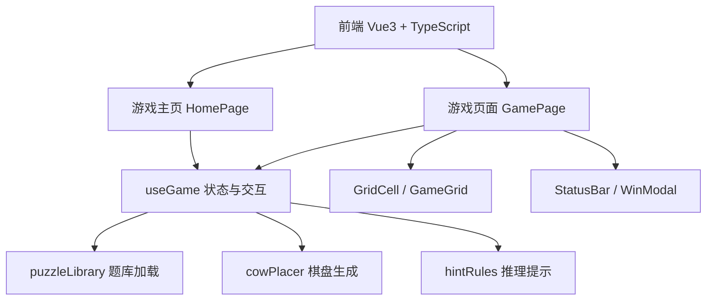

## 1. 架构设计



纯前端项目，无后端服务。关卡数据存放在 `public/puzzles/*.json` 与 `manifest.json`。

## 2. 技术说明

- 前端：Vue 3 + TypeScript + Vite（样式以组件 scoped CSS 为主）
- 后端：无
- 数据库：无；已玩题目 ID 存 `localStorage`（`colordog.playedPuzzles`）

## 3. 路由定义

| 路由 | 用途 |
|------|------|
| / | 游戏主页，含开始按钮和规则说明 |
| /game | 游戏页面，含 n×n 方格和交互逻辑 |

## 4. 核心算法

### 4.1 颜色区域分配（`growRegions`）

1. 在棋盘上随机放置 n 个种子，各属一种颜色
2. 按目标区域大小列表（`generateTargetSizes`）将剩余格子逐格扩张到相邻未着色格
3. easy 模式：扩张时仅考虑上下左右四连通；hard 模式：八连通
4. 区域大小可变，总和为 n²；大棋盘（n≥8）会刻意生成若干小块区域以增加难度

备选策略 `createSnakeColorOf`（蛇形条带）用于兜底；题库生成优先 `grow`，因蛇形布局常有多解。

### 4.2 牛放置算法（`placeCowsInRegions`）

1. 按随机行序回溯：每行选一列放牛
2. 约束：列不重复、颜色不重复（每种颜色恰好一头牛）、与已放牛八邻域不相邻
3. 失败则回溯；与旧文档「随机排列再试」不同，当前实现直接结合颜色区域回溯

### 4.3 题目验收（`createGameState` / `generate-puzzles`）

- `requireUnique`：枚举放牛方案，要求唯一解（`countCowSolutions`）
- `hintCheck`：模拟玩家按 `getHint` 链式标记/揭开，直至找齐 n 头牛（`isHintSolvable`）
- 运行时 `startGame` 默认从题库加载且 `hintCheck: false`，避免无题库时同步校验卡死主线程

### 4.4 推理提示（`hintRules.ts`）

按优先级依次尝试，返回 `HintInfo`（`type: 'flag' | 'cow'`）：

1. 已揭开的牛（同行/同列/周围）、唯一颜色、同色同行/列、三格夹角、四格夹角、双色单邻、T字形、多格加一
2. 唯一活跃行/列、整行/列同色、N 色占 N 行/列、N 行/列仅 N 色
3. ~~唯一解定位/排除~~（已关闭）
4. **假设反证**（仅当以上均无时）：取活跃格最少的颜色，逐格假定该格为牛并标记其行列与周围 8 格，再在模拟盘上跑 deductive 规则；若推出「牛」但该格实际无牛，则该假设格可画叉
5. ~~猜测提示~~（已关闭，题库生成与 `isHintSolvable` 均不依赖）

活跃格定义：未揭开且未打叉。

## 5. 数据模型

### 5.1 核心类型（`cowPlacer.ts`）

```typescript
type GameMode = 'easy' | 'hard'

interface CellState {
  colorIndex: number
  hasCow: boolean
  isRevealed: boolean
  isFlagged: boolean   // 灰色叉：标记无牛
  isWrong: boolean     // 红色叉：揭开但无牛
}

interface GameState {
  n: number
  mode: GameMode
  grid: CellState[][]
  cowsFound: number
  totalCows: number
  isWon: boolean
  guessHintsUsed: number
}
```

### 5.2 题库 JSON（`StoredPuzzle`）

```typescript
interface StoredPuzzle {
  id: string
  n: number
  mode: GameMode
  colorGrid: number[][]
  cows: [number, number][]
}
```

## 6. 组件结构

```
src/
├── components/
│   ├── GridCell.vue        # 单格：颜色、叉、牛、提示高亮
│   ├── GameGrid.vue        # n×n 容器
│   ├── CowSprite.vue       # 牛贴图
│   ├── StatusBar.vue       # 进度、VIP、重来
│   └── WinModal.vue        # 胜利弹窗
├── composables/
│   └── useGame.ts          # 状态、题库开局、点按/滑动/揭开、提示应用
├── pages/
│   ├── HomePage.vue
│   └── GamePage.vue
├── utils/
│   ├── cowPlacer.ts        # 棋盘生成与类型
│   ├── hintRules.ts        # 推理与可解性校验
│   └── puzzleLibrary.ts    # manifest 加载与已玩记录
├── router/index.ts
├── App.vue
└── main.ts

public/puzzles/
├── manifest.json           # 按 mode、边长索引题目文件
└── easy-{n}-{id}.json

scripts/
└── generate-puzzles.ts     # 批量生成题库
```

## 7. 交互时序（`useGame.ts`）

| 输入 | 行为 |
|------|------|
| 点按/按下 | 未揭开格切换灰色叉；记录时间与坐标 |
| 300ms 内同格再按 | 取消叉并揭开 |
| 按下后滑动 | 沿路径批量打叉或取消（由起点格当前是否已有叉决定模式） |
| `revealCell` 有牛 | `cowsFound++`；VIP 时 `autoFlagAroundCow` |
| `revealCell` 无牛 | `isWrong = true`，不结束对局 |
